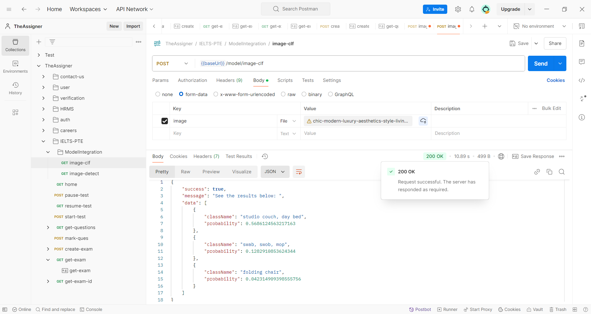

# IELTS-PTE-Backend-Model

# Postman workspace 
https://www.postman.com/sarmt/theassigner/overview

## POST
# object-detection

## POST
# image-classification

## POST
# sentiment-analysis

## POST
# post-node-with-flask-req

## GET
# get-node-with-flask-req
